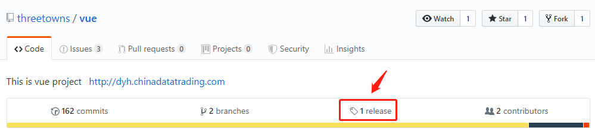
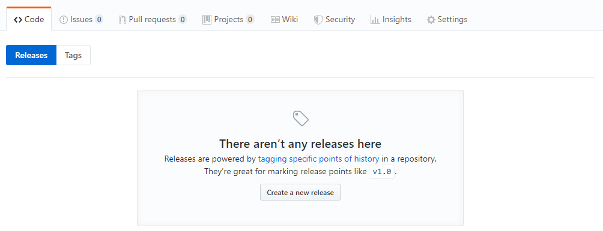
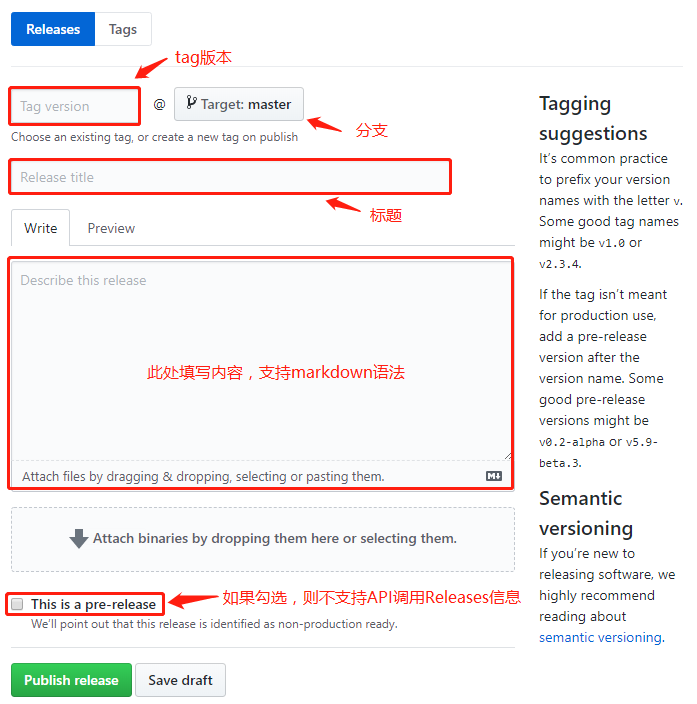
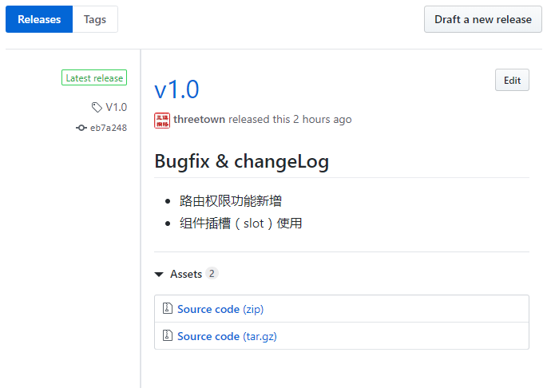

# GitHub Tag and Release

> 标签(tag)，是特定提交(commit)一个指针，也就是**每个tag对应一个特定的commit**。
>
> Release是具有changelogs和二进制文件的一级对象，它可以代表超出Git架构本身的一个特定时间点之前的所有项目历史。也就是**通过release，不但能够通过源码体现出项目历史，还能通过已经编译好的二进制文件来进一步描述此时的项目状态**。


## 一、创建Tag

tag分为两种：`lightweight` 和 `annotated`

* 创建 `lightweight` 类型：

  ```bash
  git tag v1.0-lw
  ```

* 创建 `annotaged` 类型：

  ```bash
  git tag -a v1.0 -m "My version 1.0"
  ```

  通过tag可以返回到项目的特定状态下，所以可以将tag看作是在大量commit中设定的书签。

* 提交tag

  ```bash
  git push origin --tags
  ```


## 二、创建 Release

创建release，则需要通过源码托管商的网页操作界面来进行，一般会要求填写tag名、分支以及相应的发布说明，还可上传编译好的程序、打包好的文件等。

1. 在 repo 主页上，点击 `release` ，进入release界面



2. 在 `release` 界面，点选 `create a new release`



3. 填写releases相关信息，并可上传额外文件



4. Publish release



5. 通过github官方提供的api，可访问我们的release信息：

   ```js
   /repos/:owner/:repo/releases/:id
   ```

   例如：`threetowns/vue` 项目api：

   ```js
   https://api.github.com/repos/threetowns/vue/releases/latest
   ```

**PS：** 在第三步中，勾选了 `pre-release` 的话，api将获取不到数据，出现如下界面 ：

```json
{
	"message": "Not Found",
	"documentation_url": "https://developer.github.com/v3/repos/releases/#get-the-latest-release"
}
```


## 三、Tag与Release比较

> release基于tag，为tag添加更丰富的信息，一般是编译好的文件。

- tag，是 git中的概念；

- release，是Github、gitLab等源码托管商所提供的更高层的概念

